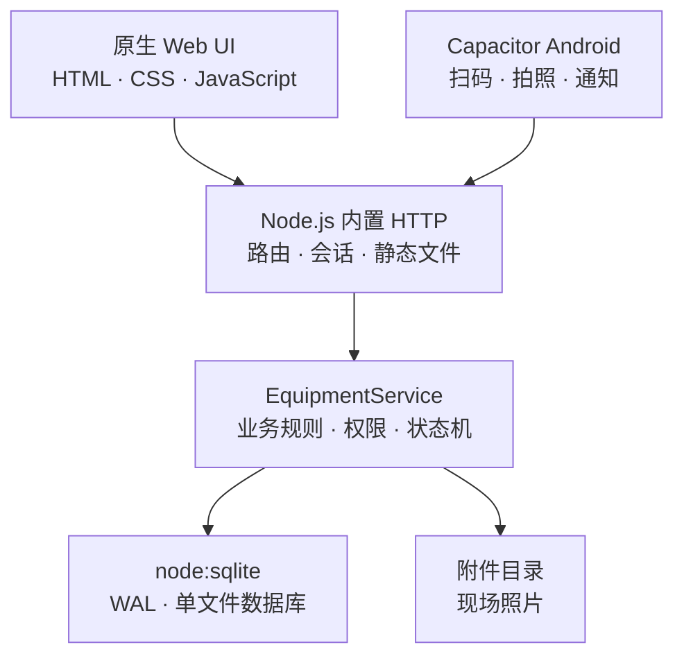

<div align="center">

  # 🏭 Production Equipment System

  **面向工厂现场的设备全生命周期与维修闭环系统**

  永久设备编码 · 产线组合追溯 · 扫码报修 · 维修工单 · 点检保养 · Android

  [](./LICENSE)
  [](https://nodejs.org/)
  [](https://www.sqlite.org/)
  [](./equipment-system/mobile)
  [](./equipment-system/web)

  [在线演示](http://8.136.107.181:8788) ·
  [Android 测试包](http://8.136.107.181:8788/downloads/ysm-equipment-mobile-test.apk) ·
  [快速开始](#快速开始) ·
  [业务手册](./equipment-system/README.md) ·
  [生产部署](./正式上云Docker部署执行手册.md)

</div>

---

## 项目定位

这不是一张只能记录“设备名称和状态”的电子台账，而是一套围绕生产现场真实动作设计的设备管理系统：

```text
设备建档与永久编码
        ↓
车间 / 产线 / 工序 / 机位组合
        ↓
扫码报修 → 接单 → 到场 → 维修 → 试运行 → 结单 → 评价
        ↓
巡检 / 点检 / 保养 / 异常转维修
        ↓
设备履历 / 停机分析 / 服务评价 / 运营报表 / 审计追踪
```

系统尤其重视三件事：

- **设备身份不随位置变化**：设备使用永久编码，搬线、换机和报废都不会改变或复用身份。
- **产线组合可以回到任意历史时点**：安装关系使用时间区间保存，不只记录“现在放在哪里”。
- **一线操作尽量简单，管理数据仍然完整**：普工扫码后说一句话即可报修，技术员到场后补齐诊断、故障代码和维修方法。

## 核心能力

| 模块 | 能力 |
|---|---|
| **设备台账** | 按“设备类型 + 关键规格”自动生成永久编码，支持 Excel 整批导入、状态管理、二维码铭牌和完整履历。 |
| **产线组合** | 建模工厂—车间—产线—工序—机位—设备关系，支持安装、移动、拆除、替换、双人复核和历史时点还原。 |
| **扫码报修** | 普工扫码或分级搜索设备，一句话报修；系统自动带出工序、记录照片并联动设备状态。 |
| **维修闭环** | 待接单、已接单、到场核对报修信息、维修、结构化试运行、结单全流程，记录响应时间、诊断原因、维修方法、零件与返修关系。 |
| **巡检与计划任务** | 支持设备巡检、结构化点检、一/二/三级保养模板、周期计划、到期任务和异常转维修。 |
| **三级权限** | 普工、技术员、管理员拥有不同数据视野和操作权限；全部权限在服务端校验。 |
| **评价与报表** | 报修人可评分并附现场照片；管理端查看可下钻的产线、故障类别、设备、技术员、停机和点检保养指标并导出 Excel。 |
| **审计与安全** | scrypt 密码哈希、一次性初始密码、会话撤销、登录限流、Origin/Host 校验、全操作审计。 |
| **Android 现场端** | Capacitor Android 壳支持相机扫码、巡检原生相机强制现场拍摄与水印、服务器切换以及厂区 Wi-Fi 内的待接单通知。 |
| **生产运维** | Docker Compose + Caddy HTTPS、SQLite 一致性备份、附件归档、SHA-256 校验、恢复和上线前检查。 |

## 在线演示

当前提供一套临时个人验证环境：

- Web：<http://8.136.107.181:8788>
- Android APK：<http://8.136.107.181:8788/downloads/ysm-equipment-mobile-test.apk>

| 角色 | 工号 | 密码 |
|---|---|---|
| 三级管理员 | `admin` | `ysm-demo-2026!` |
| 二级技术员 | `w002` | `ysm-demo-2026!` |
| 一级普工 | `w001` | `ysm-demo-2026!` |

> 这是临时公网 HTTP 演示，不用于工厂正式数据，可能因服务器到期、重启或数据重置而停止。请勿在演示环境输入真实人员、设备、照片或密码。

仓库内还提供已清除会话、设备令牌和登录锁定信息的[演示数据库与测试附件](./equipment-system/demo-data/README.md)，可以在本地复现相同数据状态。

## 快速开始

### 环境要求

- Node.js 22.5 或更高版本；系统使用 Node 内置 `node:sqlite`
- npm
- 可选：Android Studio / Android SDK / JDK 21，用于构建 Android 测试端

运行期只有两个第三方依赖：`exceljs` 用于 Excel 导入导出，`qrcode` 用于设备与工序二维码。

### Windows

```powershell
git clone https://github.com/Bok1-YY/production-equipment-system.git
cd production-equipment-system\equipment-system
npm ci
```

随后双击仓库根目录或桌面的 `一键启动全功能设备系统.bat`。启动器自动检测当前私网 IPv4、启动完整后端、等待健康检查通过，再打开电脑页面并显示手机地址和安装页。服务在后台常驻，关闭启动窗口不会中断；需要停止时双击 `equipment-system\stop-windows.bat`。启动失败时，错误会显示在窗口中，服务日志保存在 `equipment-system\data\server-*.log`。电脑和手机共用同一套账号、功能与数据，不再区分多个“一键启动”类别。

### Linux / macOS

```bash
git clone https://github.com/Bok1-YY/production-equipment-system.git
cd production-equipment-system/equipment-system
npm ci
npm start
```

开发模式：

```bash
npm run dev
```

健康检查：

```text
GET http://127.0.0.1:8787/api/health
```

### 首次登录

首次启动会创建本地管理员：

| 工号 | 初始密码 |
|---|---|
| `admin` | `ysm-admin-2026` |

初始密码只能使用一次。登录后必须立即修改密码，再创建实际管理员、技术员与普工账号。不要把这个本地默认密码用于公网部署。

## 角色与维修流程

| 角色 | 现场职责 | 数据范围 |
|---|---|---|
| **一级普工** | 扫码报修、撤回到场前的误报、查看本人报修、评价服务、重新报修 | 只能查看自己的工单 |
| **二级技术员** | 抢单、到场、诊断、维修、试运行、结单、巡检和执行点检保养 | 自己负责的工单；台账和产线只读 |
| **三级管理员** | 台账、产线、设备变动复核、派单转派、计划模板、故障码、成员、报表和审计 | 全部管理数据 |

```text
普工报修
   ↓
待接单 ── 技术员抢单 / 管理员指派
   ↓
已接单 ── 到场前仍可由报修人撤回
   ↓
已到场 ── 核对故障设备与故障分类；两项确认后才能开工
   ↓
维修中 ── 填诊断原因、维修方法、零件；信息有误可回退核对
   ↓
待试运行 ── 选择正常 / 带问题可运行 / 无法运行，并完成结单检查
   ↓
技术员结单 ── 报修人评价 / 未修好可关联重新报修
```

“谁接单谁推进”由后端强制执行；需要换人时由管理员转派并留下历史。接单、到场、开始维修与完成分别记录时间，响应时间和实际维修时间不会混在一起。

## 永久编码与产线组合

设备编码示例：

```text
YSM-EXT-135-0001
YSM-MIX-H800-C2500-0001
YSM-PUL-0001
```

流水按“类型代码 + 关键规格”分别维护。设备换车间、换产线或换机位时，编码保持不变；作废编号不重新发放。

位置结构采用五级模型：

```text
工厂 → 车间 → 产线 → 工序 → 机位 → 当前设备
```

安装、移动、拆除和替换必须先提交，再由另一名管理员复核。系统保存设备与机位的起止时间，因此能够还原任意日期的产线设备组合。

> 批量打印设备铭牌前必须先配置 `PUBLIC_BASE_URL`。二维码中保存的是访问系统的地址；如果仍是 `127.0.0.1`，手机扫码将无法打开。

## Android 现场端

Android 测试端面向厂区局域网使用：

- 相机扫描设备或工序二维码；
- 普工扫码后直接进入报修；
- 技术员和管理员可选择巡检或报修；
- 巡检必须调用原生相机现场拍摄至少一张，自动写入设备、巡检人和时间水印，不提供相册旧图入口；
- 普工结单评价可拍照或上传现场照片，支持服务器地址切换；
- 技术员在厂区 Wi-Fi 内轮询待接单任务，并显示通知与桌面角标；
- 最低支持 Android 8。

在仓库根目录使用 Git Bash、WSL 或 Linux 执行：

```bash
./一键打包安卓测试版.sh
```

脚本会依次执行后端测试、真实浏览器冒烟、Android 单元测试与 lint、APK 构建和下载链路校验；连接 USB 调试手机时还会运行仪器测试、覆盖安装并启动 App。详细步骤见[手机测试说明](./手机测试说明.md)。

> 局域网测试包允许私网 HTTP，仅适合可信 Wi-Fi。正式 Android 包强制使用 HTTPS；当前版本不包含离线同步或公网推送。

## 生产部署

仓库提供 Docker Compose 与 Caddy 配置，目标规模为 50–200 个账号、约 30 人并发的单工厂实例：


关键约束：

- App 固定为单写实例，不横向启动多个 SQLite 写入副本；
- 数据库与附件挂载到宿主机 `/srv/ysm/data`，不写进镜像；
- App 端口只在 Docker 网络内可见，由 Caddy 对外提供 HTTPS；
- 正式环境启用 Secure Cookie、可信 Origin、登录限流和每日一致性备份；
- 上线前必须完成备份恢复演练和三角色验收。

请按[正式上云 Docker 部署执行手册](./正式上云Docker部署执行手册.md)逐项执行，不要跳过备份、备案、安全检查或回滚演练。

## 配置

| 变量 | 默认值 | 说明 |
|---|---|---|
| `HOST` | `127.0.0.1` | 服务监听地址；手机访问时需使用可信网络并改为 `0.0.0.0` |
| `PORT` | `8787` | HTTP 服务端口 |
| `YSM_DB_PATH` | `data/equipment.db` | SQLite 数据库路径 |
| `PUBLIC_BASE_URL` | 从请求推导 | 写入设备和工序二维码的访问根地址 |
| `YSM_SECURE_COOKIE` | 未启用 | HTTPS 环境设为 `1` |
| `YSM_TRUSTED_ORIGIN` | 未设置 | 正式站点允许的浏览器 Origin |
| `YSM_TRUST_PROXY` | 未启用 | 位于可信反向代理后时设为 `1` |

完整生产参数见 [`equipment-system/.env.production.example`](./equipment-system/.env.production.example)。

## 架构



- 前端无框架、无构建步骤，服务端直接提供静态文件。
- HTTP 与 SQLite 均使用 Node 标准库，减少工厂电脑上的安装和维护成本。
- 业务逻辑集中在 `src/service.js`，服务端权限是唯一安全边界。
- SQLite 使用 WAL；正式环境保持单 App 实例。

<details>
<summary><strong>项目结构</strong></summary>

```text
.
├── equipment-system/
│   ├── src/                    # Node.js 服务、业务规则、认证与 SQLite
│   ├── web/                    # 零框架响应式 Web 前端
│   ├── mobile/                 # Capacitor Android 项目
│   ├── test/                   # Node.js 回归与安全测试
│   ├── scripts/                # 冒烟、备份、恢复、模板与上线检查
│   ├── deploy/                 # Caddy 生产配置
│   ├── demo-data/              # 已脱敏的公开演示快照
│   ├── docs/                   # 设备编码与组合规则
│   ├── 导入模板/               # 台账和产线组合 XLSX 模板
│   ├── compose.production.yaml
│   └── Dockerfile
├── 一键启动全功能设备系统.bat    # Windows 唯一日常启动入口
├── 一键打包安卓测试版.sh
├── 一键启动手机测试服务.sh
├── 停止手机测试服务.sh
├── 手机测试说明.md
└── 正式上云Docker部署执行手册.md
```

</details>

## 测试、备份与恢复

```bash
cd equipment-system

npm test                   # 业务、权限、状态机、附件、导入与 HTTP 安全
npm run test:browser       # 真实浏览器桌面/移动端冒烟
npm run test:load          # 负载冒烟
npm run preflight          # 生产上线前检查
npm run backup -- /backups
node scripts/verify-backup.js /backups/<备份目录>
```

当前 148 项测试覆盖设备编码、组合变动、身份权限、照片魔数、扫码解析、维修状态机、核对报修信息、结构化试运行、评价照片可见性、巡检强制照片、运营报表下钻、点检保养、Excel 导入、登录锁定、幂等和安全响应边界。Android 改动还必须在真机或模拟器中完成权限、系统相机、照片回传和 instrumentation 验证，不能只以 APK 构建成功作为验收。

生产备份使用 SQLite `VACUUM INTO` 创建一致数据库，并归档附件和生成 SHA-256 清单。不要在服务运行时只复制 `equipment.db`，因为 WAL 中可能仍有未检查点的数据。

## 当前边界

以下能力不在当前阶段范围内：

- 库存自动扣减与采购系统联动；
- 微信/企业微信身份认证；
- PLC、传感器或其他 IoT 实时采集；
- Android 离线同步；
- 公网推送通知；
- 多租户 SaaS 与多 App 实例横向扩展。

## 文档

- [系统业务手册](./equipment-system/README.md) — 角色、报修、铭牌、导入、业务规则与首次使用顺序
- [开发手册](./equipment-system/DEVGUIDE.md) — 架构、数据模型、权限边界和开发约定
- [设备编码与组合规则](./equipment-system/docs/设备编码与组合规则.md) — 编码、流水、机位和历史组合的规则真源
- [手机测试说明](./手机测试说明.md) — Android 打包、联调与局域网测试
- [正式部署手册](./正式上云Docker部署执行手册.md) — Docker、HTTPS、备份、上线和回滚

## 数据与安全

数据库、WAL、现场附件、日志、APK、正式密钥、Android 签名和原始设备资料均不应进入 Git。仓库的 `.gitignore` 已覆盖主要运行产物，但生产环境仍必须使用独立持久卷、异机备份与定期恢复演练。

公开演示和局域网 HTTP 测试端都不能承载真实生产数据。正式环境必须使用 HTTPS、稳定域名、正式签名包和受控网络访问。

## License

[MIT](./LICENSE) © 2026 Bok1-YY
